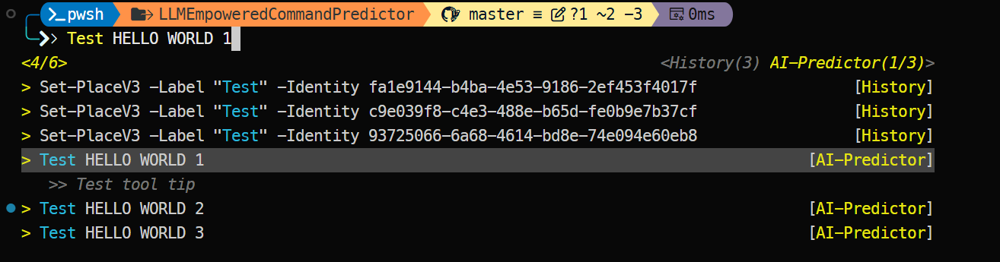

## LLM Emphasisered Command Predictor

### Prerequisites
This project provides a command predictor that leverages large language models (LLMs) to suggest commands based on user input.

You need to have the following prerequisites installed:
- .NET SDK (version 6.0 or later)
- PowerShell 7 or later
- PSReadline module

1. Enable Powershell experimental feature:

```powershell
Enable-ExperimentalFeature PSSubsystemPluginModel
```

2. Build the project:

```powershell
dotnet build -c Release
```

3. Open another PowerShell terminal and run the following command to load the module:

```powershell
Import-Module ".\bin\Release\LLMEmpoweredCommandPredictor\net6.0\LLMEmpoweredCommandPredictor.dll" -Verbose
Set-PSReadLineOption -PredictionSource HistoryAndPlugin
```

4. Start using the command predictor:



### Task breakdown

``` plaintext
+---------------------------------------------------+
|                   POWERSHELL                      |
+---------------------+-----------------------------+
                      |
                      | Interacts with
                      v
+---------------------+-----------------------------+
|              COMMAND PREDICTOR                    |
|  (ICommandPredictor implementation)               |
+---------------------+-----------------------------+
                      |
         +------------+-------------+
         |                          |
         | Requests                 | Retrieves from
         v                          v
+--------+-----------+    +---------+------------+
|  BACKGROUND SERVICE |    |    IN-MEMORY CACHE   |
|  (Long-running      |<-->| (Fast retrieval with |
|   process)          |    |  TTL & LRU eviction) |
+--------+-----------+    +---------------------+
         |
         | Uses
         v
+--------+-----------+
|  CONTEXT COLLECTOR |
| (Gathers user env  |
|  information)      |
+--------------------+

   Communication Flow:
   ==================
   
   1. User types command in PowerShell
   2. Command Predictor receives input
   3. Predictor checks cache for suggestions
   4. If cache miss, requests from Background Service
   5. Background Service generates suggestions via LLM
   6. Suggestions stored in cache for future use
   7. Predictor displays suggestions to user

   Data Flow:
   =========
   
   +-------------+     +-------------+     +-------------+
   | User Input  |---->| Context     |---->| LLM         |
   | & History   |     | Processing  |     | Generation  |
   +-------------+     +-------------+     +-------------+
                                                |
   +-------------+     +-------------+     +-------------+
   | PowerShell  |<----| Command     |<----| Suggestion  |
   | Display     |     | Filtering   |     | Formatting  |
   +-------------+     +-------------+     +-------------+
```

#### Architecture Overview
The LLM Empowered Command Predictor consists of the following components:

1. **Command Predictor**: The main interface that PowerShell interacts with.
2. **Background Service**: A long-running process that generates command suggestions.
3. **In-Memory Cache**: Stores generated suggestions for quick retrieval.
4. **Context Collector**: Gathers information to provide context for LLM.

#### Background Service Design
The background service is a long-running process that:
- Starts when the PowerShell module is loaded
- Runs independently of the main PowerShell thread
- Generates suggestions based on user's context
- Updates the in-memory cache with new suggestions

#### Cache Design
The in-memory cache:
- Stores suggestions keyed by context hash
- Implements time-to-live (TTL) for entries
- Uses LRU (Least Recently Used) eviction policy
- Provides fast lookup for the predictor

#### Inter-Process Communication
The predictor and background service communicate through:
- Named pipes for Windows-native IPC
- Simple message protocol for requests and responses
- Asynchronous communication to prevent UI blocking

#### Implementation Tasks

1. **Core Components**
   - Implement the background service as a standalone process
   - Create the suggestion cache with TTL and eviction policies
   - Design the IPC protocol between the predictor and service

2. **Context Management**
   - Collect command history and session information
   - Track loaded modules and available commands
   - Create context hashing mechanism for cache keys

3. **LLM Integration**
   - Develop service interface for LLM providers
   - Design effective prompts for command prediction
   - Implement response parsing and suggestion filtering

4. **Testing and Optimization**
   - Benchmark prediction latency and accuracy
   - Optimize cache hit rates
   - Test memory usage and performance